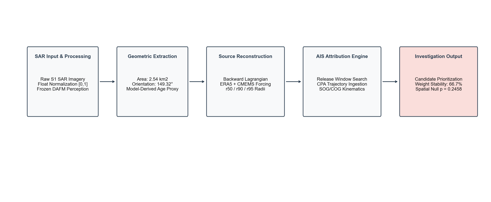
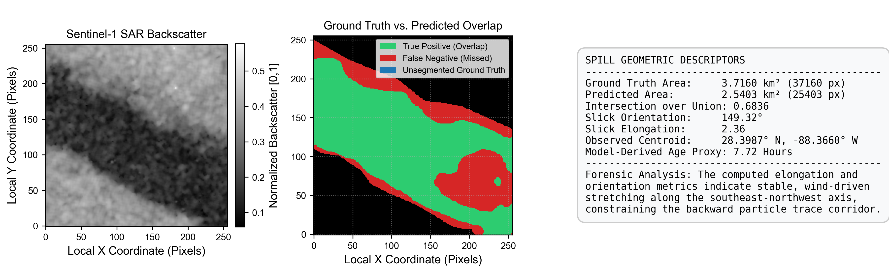
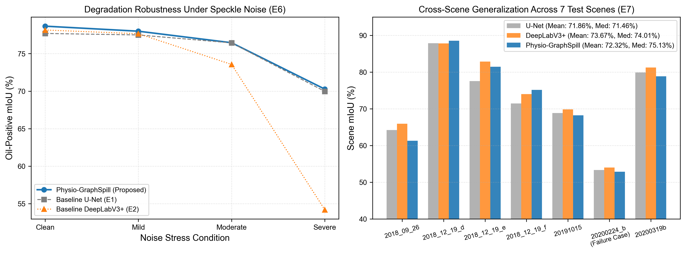
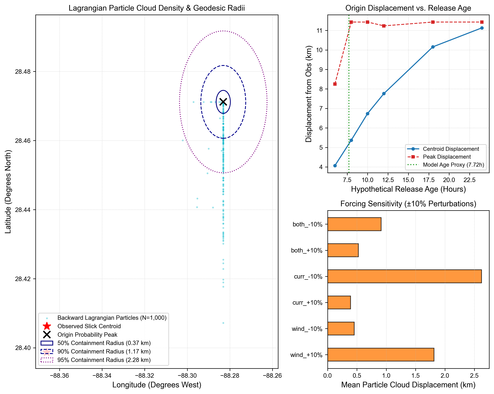
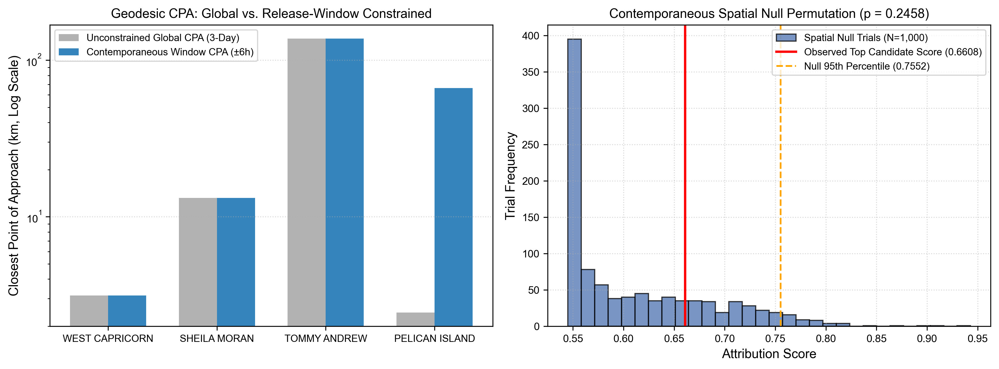
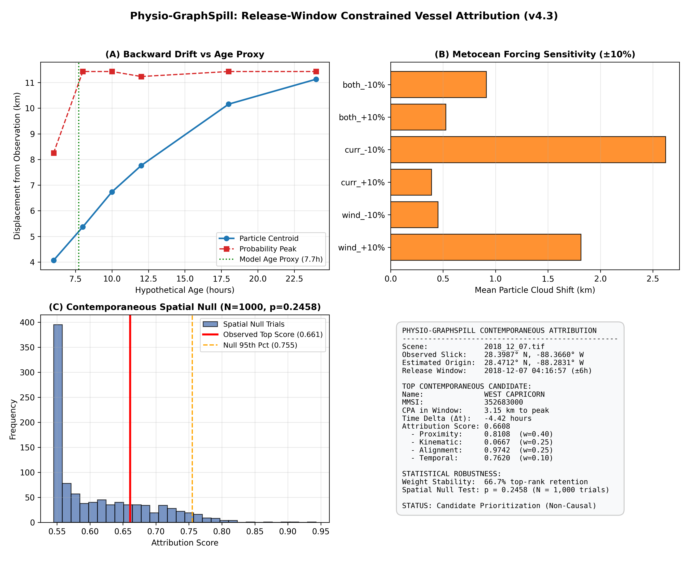

# Physio-GraphSpill

## Degradation-Aware Multimodal Learning for Marine Oil-Spill Detection and Vessel Attribution Using Satellite Imagery and AIS Data

**SIH26143 | Track T7 — Energy, Sustainability & Climate Action | NTRO**

---

## 1. Title

**Degradation-Aware Multimodal Learning for Marine Oil-Spill Detection and Vessel Attribution Using Satellite Imagery and AIS Data**

| Field | Value |
|-------|-------|
| Problem ID | SIH26143 |
| Track | T7 — Energy, Sustainability & Climate Action |
| Category | Software / Disaster Management |
| Organization | National Technical Research Organisation (NTRO) |
| Architecture | Physio-GraphSpill |
| Lead Researcher | Yadhav Balaji Rao, Ph.D. Scholar, Amrita Vishwa Vidyapeetham |

---

## 2. Problem Statement

Marine oil spills inflict catastrophic damage on marine ecosystems and frequently remain unattributable to the responsible vessel. Conventional detection systems focus primarily on pixel-level segmentation of satellite imagery but fail to address the operational investigation pipeline: estimating spill geometry, reconstructing a physically plausible release region, and identifying vessel traffic that is spatially and temporally consistent with the event.

This project addresses the complete investigation workflow by integrating Sentinel-1 SAR perception, oceanographic drift modeling, and AIS trajectory analysis into a single multimodal intelligence system.

---

## 3. Objectives

1. Develop a degradation-aware deep learning model for robust marine oil-spill segmentation from Sentinel-1 SAR imagery under severe speckle noise conditions.
2. Characterize detected slicks using geometric central moments (area, orientation, elongation) and derive a model-based age proxy for release-time estimation.
3. Reconstruct a physically plausible historical source region using backward Lagrangian particle transport driven by ERA5 wind and CMEMS ocean current forcing.
4. Integrate AIS proximity, kinematic, directional, and temporal evidence within a contemporaneous release window for candidate vessel prioritization.
5. Evaluate model robustness under progressive SAR degradation and cross-scene generalization across seven independent test scenes.
6. Build an interactive investigation dashboard supporting live SAR upload, full-resolution tiled inference, and multimodal evidence visualization.

---

## 4. Novelty and Key Contributions

| # | Contribution | Description |
|:-:|-------------|-------------|
| C1 | **Degradation-Aware SAR Perception** | DAFM mechanism coupled with ASPP multi-scale bottleneck maintaining accuracy under severe speckle corruption where baselines collapse. |
| C2 | **Uncertainty-Aware Source Reconstruction** | Probabilistic backward Lagrangian tracing (N=1,000) with geodesic containment radii and metocean sensitivity analysis. |
| C3 | **Spatiotemporal AIS Prioritization** | Release-window-constrained scoring engine fusing CPA, kinematics, axial alignment, and temporal consistency. |
| C4 | **Statistical Null Validation** | 1,000-trial spatial null permutation test for scientifically defensible candidate reporting. |
| C5 | **Full-Resolution Tiled Inference** | Sliding-window pipeline (256x256, 2D Hann blending) at native pixel scale without distortion. |

---

## 5. Proposed Framework

*Figure 1: End-to-end multimodal pipeline from SAR ingestion through AIS candidate prioritization.*

`mermaid
graph LR
    A["1. SAR INPUT"] --> B["2. PERCEPTION"]
    B --> C["3. GEOMETRY"]
    C --> D["4. PHYSICS"]
    D --> E["5. AIS RANKING"]
    E --> F["6. DECISION"]
    M1[("ERA5+CMEMS")] -.-> D
    M2[("NOAA AIS")] -.-> E
- Raw float normalization [0, 1]
- Sliding-window tiled inference (256x256, stride 128)

### 5.2 Neural Perception (E5.2)
- Degradation-Aware Feature Modulation (DAFM)
- Atrous Spatial Pyramid Pooling (ASPP) bottleneck
- Frozen threshold tau = 0.50, zero morphological post-processing

### 5.3 Slick Characterization
- Area, orientation, elongation from central moments
- Model-derived age proxy (empirical heuristic)
- Multi-tier QC decision engine

### 5.4 Lagrangian Source Reconstruction
- ERA5 winds + CMEMS currents
- Backward drift: N=1,000 particles, -24h
- Geodesic containment: r50/r90/r95
- Forward projection: +24h

### 5.5 AIS Candidate Prioritization
- Release-window filtering (+/-6h)
- CPA + kinematic + alignment + temporal scoring
- 1,000-trial spatial null test
- 6-configuration weight sensitivity grid

---

## 6. Datasets

### 6.1 SAR Imagery
- 1,200 Sentinel-1 GeoTIFF scenes (Gulf of Mexico)
- 21,744 training patches, 7,249 validation patches (256x256)
- Oil-pixel prevalence: ~4.37%
- 7 held-out test scenes

### 6.2 AIS Trajectories
- NOAA MarineCadastre, Gulf of Mexico, Dec 6-8 2018
- 2,061,992 records, 1,437 vessels
- 253 contemporaneous vessels in +/-6h window

### 6.3 Environmental Forcing
- ERA5 reanalysis wind (10m u/v)
- CMEMS ocean currents (u/v)
- NetCDF4 interpolated grid

---

## 7. Key Results

### 7.1 SAR Perception and Segmentation

*Figure 2: Sentinel-1 SAR backscatter, ground truth vs prediction overlap, and geometric descriptors for Patch #482.*

#### Segmentation Benchmark (E5.2)

| Model | mIoU (%) | Dice (%) | Precision (%) | Recall (%) |
|-------|---------:|---------:|--------------:|-----------:|
| U-Net (E1) | 81.48 | 76.00 | 74.66 | 82.39 |
| DeepLabV3+ (E2) | 80.16 | 73.69 | 69.86 | **84.23** |
| **Physio-GraphSpill (E5.2)** | **83.49** | **78.84** | **78.47** | 83.16 |

### 7.2 Degradation Robustness and Generalization

*Figure 3: E6 speckle noise degradation curves and E7 cross-scene generalization across 7 test scenes.*

#### E6 — Severe Speckle Noise

| Condition | U-Net | DeepLabV3+ | Physio-GraphSpill |
|-----------|------:|-----------:|------------------:|
| Clean | 77.69 | 78.15 | **78.66** |
| Mild | 77.49 | 77.65 | **77.99** |
| Moderate | 76.43 | 73.56 | **76.45** |
| Severe | 69.97 | 54.19 | **70.27** |

#### E7 — Cross-Scene Generalization

| Metric | U-Net | DeepLabV3+ | Physio-GraphSpill |
|--------|------:|-----------:|------------------:|
| Mean mIoU | 71.86% | **73.67%** | 72.32% |
| Median mIoU | 71.46% | 74.01% | **75.13%** |
| Best Scene | 87.86% | 87.82% | **88.52%** |
| Worst Scene | 53.30% | **54.01%** | 52.86% |

### 7.3 Lagrangian Source Reconstruction

*Figure 4: Backward particle cloud with geodesic containment radii, age-proxy sensitivity, and metocean forcing perturbation.*

#### Case Parameters (2018-12-07, Patch #482)

| Parameter | Value |
|-----------|-------|
| Observed Centroid | 28.3987N, -88.3660W |
| Predicted Area | 2.5403 km2 |
| Ground Truth Area | 3.7160 km2 |
| IoU / Dice | 0.6836 / 0.8121 |
| Orientation / Elongation | 149.32 deg / 2.36 |
| Model Age Proxy | 7.72 hours |
| Origin Peak | 28.4712N, -88.2831W |
| Origin Displacement | 11.43 km |
| r50 / r90 / r95 | 0.37 / 1.17 / 2.28 km |
| Forward Drift (t=0 / t=24) | 0.11 km / 11.55 km |

### 7.4 AIS Candidate Prioritization

*Figure 5: Global vs release-window CPA comparison and spatial null permutation distribution (N=1,000, p=0.2458).*

#### Contemporaneous Leaderboard (+/-6h Release Window)

| Rank | Vessel | MMSI | CPA (km) | dt (h) | SOG (kn) | Score |
|:---:|--------|:----:|---------:|-------:|---------:|------:|
| **1** | **WEST CAPRICORN** | **352683000** | **3.15** | **-4.42** | **0.1** | **0.6608** |
| 2 | SHEILA MORAN | 366939810 | 13.19 | -3.67 | 7.8 | 0.5536 |
| 3 | TOMMY ANDREW | 367378180 | 137.37 | -5.99 | 6.0 | 0.5449 |
| 4 | ODYSSEA SPIRIT | 368042000 | 26.68 | +3.42 | 3.5 | 0.5109 |
| 5 | PACIFIC SHARAV | 636016002 | 11.70 | -2.44 | 0.1 | 0.5098 |
| -- | PELICAN ISLAND (rejected) | 367684260 | 66.38 | +41.2 | 7.7 | False alarm |

- **Weight Stability:** 66.7% (4/6 configurations)
- **Spatial Null:** p = 0.2458 (investigative prioritization, not causal proof)

### 7.5 Complete Validation Panel

*Figure 6: Integrated v4.3 validation panel showing age sensitivity, metocean perturbation, spatial null distribution, and candidate dossier.*

---

## 8. Reproducibility Protocol

### Frozen Perception

| Parameter | Value |
|-----------|-------|
| Input | Raw float [0, 1] |
| Model | Physio-GraphSpill E5.2 |
| Threshold | tau = 0.50 |
| Morphology | NONE (0 px) |
| Inference | Sliding-window tiled (256x256, stride 128, 2D Hann) |

### Frozen AIS

| Parameter | Value |
|-----------|-------|
| Release Window | +/-6 hours |
| Evidence | Proximity + Kinematic + Alignment + Temporal |
| Weights | (0.40, 0.25, 0.25, 0.10) |
| Null Trials | 1,000 |

---

## 9. Scientific Disclaimers

1. **Candidate Prioritization is not Causal Attribution.** AIS ranking provides investigative leads, not legal proof.
2. **Model-Derived Age Proxy.** Empirical heuristic, not a validated timestamp.
3. **Forward Drift = Projection.** Uses available reanalysis forcing, not an operational forecast.
4. **Spatial Null p = 0.2458.** Not statistically significant under the tested null model.

---

## 10. Project Structure

|   |-- drift/             # Lagrangian particle engine
|   |-- ais/               # AIS ingestion and scoring
|   |-- environment/       # ERA5 + CMEMS forcing
|   |-- datasets/          # Data loaders
|   +-- utils/             # Geometry, metrics
|-- scripts/               # Validation suites
|-- dashboard/             # Streamlit app
|-- docs/                  # Manuscript and poster
|-- results/               # Frozen outputs and figures
|-- models/                # Checkpoints (see guide)
|-- data/                  # Datasets (see guide)
|-- experiments/
|-- notebooks/
|-- poster/
+-- tests/
`ash
git clone https://github.com/YBalajiRao/SIH26143_OilSpill.git
cd SIH26143_OilSpill
pip install -r requirements.txt

Run validation:
`ash
python scripts/run_physics_ais_validation_v43.py
See [data_sources_and_models.md](data_sources_and_models.md) for download links:
- Sentinel-1 SAR (Zenodo)
- ERA5 (Copernicus CDS)
- CMEMS (Copernicus Marine)
- AIS (NOAA MarineCadastre)
- E5.2 Checkpoint

---

## 13. Author

**Yadhav Balaji Rao**
Ph.D. Research Scholar (Full Time)
Amrita School of Computing, Amrita Vishwa Vidyapeetham, Chennai

---

## 14. Acknowledgments

- Smart India Hackathon 2026 (SIH26143)
- National Technical Research Organisation (NTRO)
- Track T7: Energy, Sustainability and Climate Action
- Data: ESA Sentinel-1, Copernicus ERA5/CMEMS, NOAA MarineCadastre
